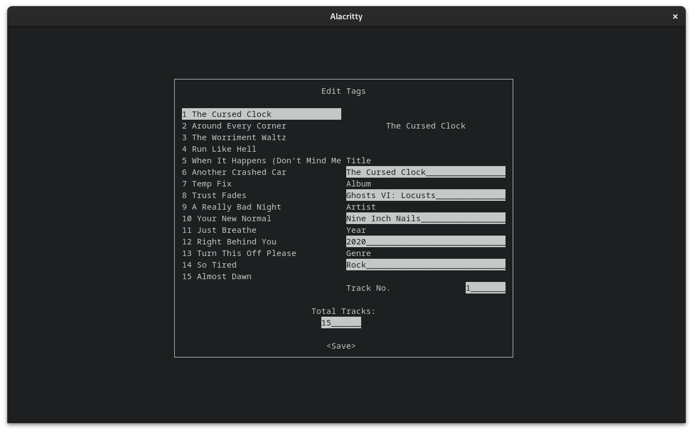

# Musicfetch
Musicfetch is a tool for downloading music from Youtube and other platforms. It allows you to add metadata to your music which will then be displayed in your music player of choice. 


## Supported Song metadata:
- Title
- Album Title
- Artist
- Year released
- Genre
- Track Number
- Total Tracks

## Compiling
Select the nightly Rust toolchain and enter `cargo build --release`. To install musicfetch enter `cargo install --path .`

## Usage
```
musicfetch

Usage:
    musicfetch <url>...
    musicfetch (-c | --cover_url) <cover_url> <url>
    musicfetch (-o | --output_dir) <output_dir> <url>
    musicfetch -? | -h | --help

Options:
    -? -h --help        Show this help
    -v --version        Print version and exit
    -c --cover_url      Specify the url of the cover that should be added to the songs
    -o --output_dir     Specify the directory the songs should be downloaded to
    -C --config         Use the config with this name
```

### UI
The UI for entering Metadata has been designed to need as few key presses as possible to get to where you want.

Use the arrow keys to navigate the UI.
On the left you can select the song you want to edit. In front of the song title, it's track number is shown. Then go to the right and edit the song fields. If you want to quickly switch songs while staying in the same field you can use the PageUp and PageDown keys.

When you change the track number of a song, they will be reordered in the selectview to reflect that change. Use Shift+Up or Shift+Down to increase or decrease the track number for a song. Alternatively, use the number keys 1-9 to set it directly.

### Configuration
Under $XDG_CONFIG_HOME/musicfetch or $HOME/.config/musicfetch you can find and place .toml files with configuration. `default.toml` is the default and is documented well. Look in there for a list of options and explainations.

## Dependencies
- [yt-dlp](https://github.com/yt-dlp/yt-dlp)

## Errors Explained
`Error in module rename:: Song '' has no field '' or field is empty` - The rename module tried inserting a song field into the filename but it was empty. Try running musicfetch again and ensuring that all fields are set